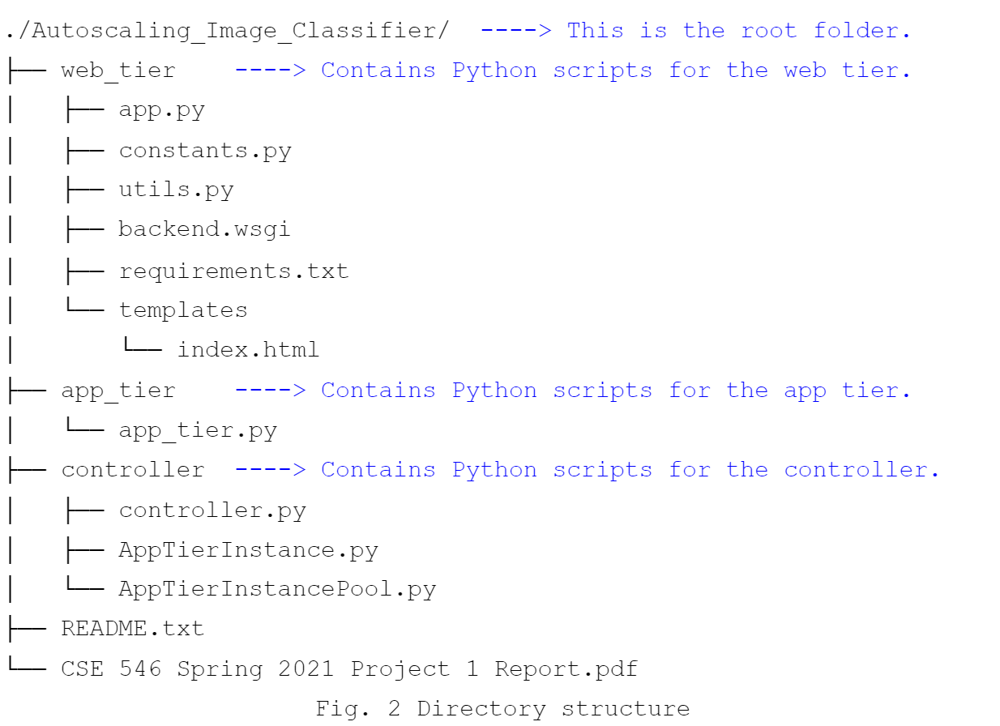

# Autoscaling Image Classifier
## Problem Statement
In this modern era of cloud computing, it can be tempting to take advantage of the seemingly infinite resources that the cloud provides to users. However, due to the metering capabilities it leverages, it is incredibly important that cloud solutions do not use more resources than they require. If left unchecked, the costs associated with using cloud resources can quickly escalate. The main aim of this project is to create an elastic cloud application which will be able to dynamically scale itself on demand and cost-effectively by using IaaS cloud to maximize computing power and minimize cost. The application will be able to classify images uploaded to it by the user. Our application will be able to leverage multiple EC2 instances simultaneously to classify large inputs as quickly as possible. This autoscaling ability will allow the application to fully harness the power of the cloud to perform efficiently while also keeping costs at a minimum. 

## Architecture

### Web Tier
The Web Tier, shown in green, was implemented in Python as a web server using the Flask framework, and the Boto3 Python SDK was used for interaction with AWS resources. The web server has four routes: GET /, POST /classify, and GET /results, and POST /reset. The GET / route serves the HTML webpage that acts as the user interface for the application. When the user selects images and presses the "Upload Image" button on the webpage, an HTTP request is sent to the POST /classify route with the images as the request payload. The images are uploaded into the Input S3 bucket, and a corresponding message containing the image name is enqueued into the Request Queue (a standard SQS queue). When the image classification is finished and the results have been set to the Response Queue, the user can press the "Get Results" button in order to fetch the classification results. When the "Get Results" button is pressed, an HTTP request is sent to the GET /results route. The results are read from the Response Queue (again, a standard SQS queue), assigned a serial number, and then returned back to the user and displayed on the webpage along with the number of classification results. The user can "reset" the application by pressing the "Reset" button, which will send an HTTP request to the POST /reset route. This will clear the input and output buckets as well as the Response Queue. 
### Controller
The controller was implemented as a looping Python script. At the beginning of each loop, the controller queries SQS for the approximate length of the request SQS queue. This length is calculated by summing the number of visible and invisible messages in the queue, which correspond to the "ApproximateNumberOfMessages" and "ApproximateNumberOfMessagesNotVisible" attributes of the queue, respectively. The controller relies on the AppTierInstancePool class in order to keep track of the running instances. The AppTierInstancePool class represents the pool of App Tier instances used for performing image classification and keeps track of the number of instances that are running and the number of pending shutdown requests. When the controller wants to upscale, it launches a number of EC2 instances from a custom AMI (which was created on top of the provided project AMI and contains our App Tier code in addition to the provided classification script) using the Boto3 SDK and uses the UserData parameter to attach a startup script that starts the App Tier thread in the background when the instance starts up. It also generates and associates a unique "App Tier ID" to the App Tier thread/instance. The pool will cap the number of instances in a "Running" state at 19. When the controller wants to downscale, it sends a message to the Shutdown Request Queue, implemented as a FIFO SQS queue, where each message represents a request to terminate 1 instance. A random app tier instance will receive this message, stop polling for new messages, and will send a message to the Shutdown Confirmed Queue, also implemented as a FIFO SQS queue, indicating that it has stopped processing new requests and is safe to terminate. The controller will process messages from the Shutdown Confirmed Queue and will terminate the corresponding instance for each message based on the App Tier ID specified in the message. This shutdown queueing system prevents the controller from accidentally terminating an instance that is still in the middle of an image classification task. The queueing system also allows the controller to potentially cancel shutdown requests by deleting messages from the shutdown request queue if a sudden burst of new requests arrives in the request queue immediately after initiating downscaling. 
### App Tier
The App Tier is implemented as a looping Python script that is run on each App Tier instance on launch. At the beginning of each loop, it polls the Request Queue for a request. If it finds a request, it downloads the corresponding image from S3 into its local filesystem, classifies the image using the classification script provided in the project AMI, enqueues a response containing an (image_name, classification_result) key-value pair into the Response Queue, and stores the classification result into a the S3 output bucket as an S3 object keyed by the image name and the containing the (image_name, classification_result) key-value pair. After performing this image classification process, the App Tier will then poll the shutdown request queue. If it receives a shutdown request, it will input a message containing its App Tier ID into the Shutdown Confirmed Queue and exit from the loop. Otherwise, it will sleep for 5 seconds and then poll the Request Queue again for a request.

## Autoscaling
Autoscaling is achieved with the help of 2 dedicated queues, the Shutdown Request Queue and the Shutdown Confirmed Queue, which helps the controller downscale and upscale the app tier as and when required. Autoscaling is achieved while observing the hard limit of a maximum deployment of 20 EC2 instances at once, as a part of the free tier of AWS. Since the Web tier and the Controller are deployed on one EC2 instance, an additional 19 App tier EC2 instances can be spun up for autoscaling.

*Shutdown Request Queue*: This queue is enqueued by the controller with messages when the controller wants to downscale. The content of the message does not matter, rather the number of messages in this queue does.

*Shutdown Confirmed Queue*: This queue is enqueued by specific App tier instances with a message denoting that they are ready to be terminated. The message contains a generated id for the instance that was assigned to the instance by the controller when it was created. This helps the controller identify which instance to shut down for downscaling. An App tier instance will only send a message in this queue if it received a message in the Shutdown Request Queue.

Let’s take an *example to explain how we have implemented autoscaling:*

Suppose the user decides to upload 100 images at once. Thus, 100 messages are enqueued in the Request Queue.

The controller polls the Request Queue every 5 seconds. The controller counts the number of messages in the Request Queue. The controller also keeps a count of the number of projected App tier instances currently running. Here we use the term projected because it is not the actual count of App tier instances running, but the difference between the number of running App tier instances detected and the number of App tier instances which have been asked to “shutdown” via the Shutdown Request Queue.

Suppose the controller is in the initial poll state and counts 100 messages in the Request Queue. The controller has not spun up any App tier instance prior to this and hence spins up the maximum number of instances it can spin up i.e. 19 instances. This is because 100 is greater than 19. While spinning up each instance, the controller assigns an App Tier ID (number between 1 and 19, inclusive) to the instance to identify it later.

Now, each of the App tier instances will start polling the Request Queue for messages and process each message one by one. Once an App tier instance is done processing a message (classifying the image,) it will enqueue the Response Queue with the image name and the classification result associated with the image. It will also save the same in the Output S3 bucket. It will then delete the message from the Request Queue and check the Shutdown Request Queue for any messages. If a message is not received, it will poll the Request Queue again and process the next image.

In our example the 19 App tier instances spun up by the controller will keep on processing messages from the Request Queue, in parallel, until the number of messages in the queue becomes less than 19 i.e. less than 19 images are left to be processed. Suppose the 19 instances are processing the last 19 images and one of the instances is done processing earlier. There are now only 18 messages in the Request Queue. The controller compares this to the number of projected App tier instances currently running and realizes that we have an extra App tier instance running. The controller sends a message in the Shutdown Request Queue. The App tier instance which finished processing the image first will read this message from the Shutdown Request Queue and sends a message across the Shutdown Confirmed Queue with the App Tier ID assigned to it by the controller. This is essentially an App tier instance telling the controller that it is no longer accepting any new image classification jobs and is safe to be terminated.

The controller will poll the Shutdown Confirmed Queue at the end of each iteration and terminate the instances from which it received a “shutdown confirmation” message. Thus, the controller keeps track of requests from the user and sends messages across the Shutdown Queue depending on the number of App tier instances it wants to terminate to downscale.

Suppose in our example the controller has successfully terminated 14 instances while it has sent out “shutdown requests” for the remaining 5 instances but is yet to receive “shutdown confirmation” from them. Now suppose in between this the user decides to upload 10 more images for classification, thus resulting in 10 messages in the Request Queue. The controller will then dequeue the 5 messages from the Shutdown Request Queue, thus retracting the “shutdown requests” it had already sent to the remaining 5 instances. The controller will be required to spin up only 5 additional App tier instances, essentially reusing the remaining App tier instances for the new set of images. Once all the images have been processed, the controller will downscale normally by the process described above. Hence, we have achieved efficient autoscaling for our Web app.

## Testing and evaluation
To test our application, we tried running it with each of the different images from the provided input image set. We tried testing it with just a single image at first, and then tried increasing the load to see how it performed with large amounts of input. We measured the success of the attempt by the amount of time it takes. During testing, we watched the number of instances which were currently running at each point in time, and ensured that the expected number were running before, during, and after the attempt. The largest test we attempted was with 416 input images, which took about 4 minutes and 20 seconds to evaluate and return its results, which the group decided to be an acceptable speed. During our last several attempts, the actual number of instances running at all tested times matched the expected number of running instances. We also tried testing the application by uploading images in multiple different batches, some while it was still completing tasks from previous uploads. Due to the asynchronous design, the backend was able to handle the incoming requests and autoscale appropriately consistently. After exhausting every test case we could think of, the group concluded that the application was ready for demonstration and submission.

## Code explanation

***web_tier (folder)***

As the name suggests, this folder contains all the code relating to our Web tier. This code will be present in the Web tier EC2 instance. Install the dependencies using pip install -r requirements.txt, then deploy the application using the Apache web server using the backend.wsgi file. The Web app interface can be accessed using the public IP address of the Web tier EC2 instance.

app.py: The Python script responsible for serving the user with the HTML webpage to upload images for classification, and once the processing is done, fetch results. It also allows the user to reset the web application by clearing the input/output S3 buckets and the Request Queue.

Function Description:

*index():* Renders the front-end template

*classify():* Accepts multiple image uploads to the S3 Input bucket and enqueues the Request Queue with requests for classification
    
*fetchResults():* Reads the Response Queue, compiles the results into a string and displays them to the user.

*reset():* Resets the Web application by clearing the input/output S3 buckets and purging the Request Queue

constants.py: Defines important constants required by the Web tier to interact with the input/output S3 buckets, and the Request/Response Queue.

utils.py: Defines various utility functions required by the Web tier to interact with the S3 buckets and the SQS queues.

Function Description:

*get_s3_client()*: Instantiates and returns a boto3 S3 client object

*save_input()*: Uploads image to S3 input bucket

*get_sqs_client()*: Instantiates and returns a boto3 SQS client object

*get_s3_resources()*: Instantiates and returns a boto3 S3 resource object

*get_num_messages_in_queue(queue_url)*: returns the number of messages currently in the specified queue

*enqueue_request(image_name)*: Enqueues the Request Queue with the image name

*clear_buckets()*: Deletes all the files in the input and output S3 buckets.

*clear_response_queue()*: Purges all of the messages in the response queue

backend.wsgi: Used for deploying the web application to EC2 instance using Apache. It imports the Flask app object.

templates/index.html: The html script to display the front-end to the user and interact with them

Function Description:

*sendToServer()*: Sends an HTTP POST request to the server containing the images selected by the user and displays the HTTP response sent back by the server

*fetchResults()*: Sends an HTTP GET request to the server and displays the HTTP message sent back by the server

*async reset()*: Asynchronously Sends an HTTP POST request to the server and displays the HTTP response sent back by the server


***app_tier (folder)***

Contains a single Python script app_tier.py. In order to deploy the App tier, copy the script as it is onto the provided project AMI. Also, make an empty folder /home/ubuntu/images where the images from the input S3 bucket will be downloaded for inference. Ensure that the Boto3 Python SDK is installed on the instance. Refer to Fig. 3 for the resulting file structure of the custom AMI. Save the custom AMI and use the AMI-ID of this new image for deployment of the App tier instances.


app_tier.py: The Python script responsible for polling messages from the Request Queue. The image corresponding to the received message is downloaded from the input S3 bucket. The class of the image is inferred by invoking the provided classifier/image_classication.py script and the result from the classification is stored in the output S3 bucket. The image name and the result from the classification is also enqueued in the Response Queue to be read and displayed by the Web tier.
After processing each message, the script checks for a shutdown request from the controller. If a shutdown request is received, it dequeues the Shutdown Request message and sends across a Shutdown Confirmed message to the controller.

Function Description:

*save_result(key, value)*: Saves the classification result in S3 output bucket

*download_image(image_name)*: Downloads the image from the S3 input bucket into the /images folder
	
*classify_image(image_name)*: Invokes the image_classification.py script to classify the image
	
*send_response(key, value)*: Sends the classification result to the response queue
	
*check_for_shutdown_request()*: Polls the shutdown request queue for shutdown requests from the controller.
	
*send_shutdown_notification()*: Sends a message to the shutdown confirmed queue indicating that this app tier instance is safe to be terminated.

***controller (folder)***
This folder contains all the code related to our controller. The controller is deployed onto the same EC2 instance as the Web tier. To start the controller run: 
```bash
python3 controller.py
```
controller.py: The Python script contains the main logical flow of the controller. It iteratively polls the number of messages in the Request Queue, computes the number of EC2 instances to create or terminate, and upscales or downscales accordingly.

Function Description:

*get_request_queue_length()*: Returns the number of messages in the Request Queue, also accounting for the number of messages already read (Invisible messages)

*run()*: Starts the controller and enforces autoscaling

AppTierInstance.py: A class that represents a currently-running App Tier Instance. The AppTierInstance class maintains the instance ID and App Tier ID of the App Tier Instance. 

It defines one method:
	
*terminate():* Terminates this App Tier EC2 instance in AWS.

AppTierInstancePool.py: Contains the AppTierInstancePool class, which defines various functions to control the creation and termination of EC2 instances as well as interface with the Shutdown Request/Confirmed Queues. The AppTierInstancePool class defines the following instance variables:

*max_instances:* The maximum number of instances that can be instantiated instances: A list of length max_instances containing the AppTierInstance objects representing currently running App Tier instances (initially all None).

*available_ids:* The list of App Tier IDs that are available to assign to new instances. The length of the list is equal to the number of additional instances that can be instantiated before the max_instances limit has been reached.
	
*AMI:* the ID of the private custom App Tier AMI we are using to launch App Tier instances off of.

*num_shutdown_requests_sent:* The number of in-flight shutdown requests (i.e. the number of shutdown requests that have been sent to the Shutdown Request queue. 

The AppTierInstancePool class defines the following methods:

*launch_instances(self, number_of_instances):* Launches new App Tier instances, where number_of_instances is the number of new instances to launch. The method will stop launching additional instances when the number of currently running instances hits max_instances (19 in this application).
	
*terminate_instance(self, app_tier_id):* Terminates the currently running App Tier instance with App Tier ID app_tier_id, replaces that instance with None in the list of AppTierInstance objects, and adds that App Tier ID back into the available_ids list.

*send_shutdown_requests(self, num_shutdown_requests):* Sends num_shutdown_requests shutdown requests to the Shutdown Request Queue.
	'
*_send_shutdown_request():* Sends a shutdown request to Shutdown Request Queue 

*cancel_shutdown_requests(self, num_cancel):* Attempts to cancel at most num_cancel (10 max) shutdown requests by delete messages from the Shutdown Request Queue.

*check_shutdown_confirmed(self):* Checks for shutdown confirmed messages (at most 10) from the shutdown request queue and, for each message, terminates the App Tier instance corresponding to the App Tier ID in the message.

*_launch_instance(self):* Launches an App Tier EC2 instance from the custom AMI and adds that instance to the list of currently running instances. It uses the UserData parameter of the Boto3 run_instances method in order to run a script that starts the App Tier thread in the background when the App Tier instance is launched.


